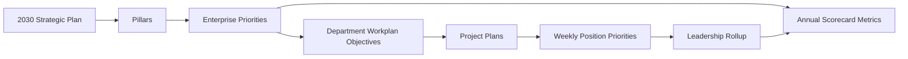
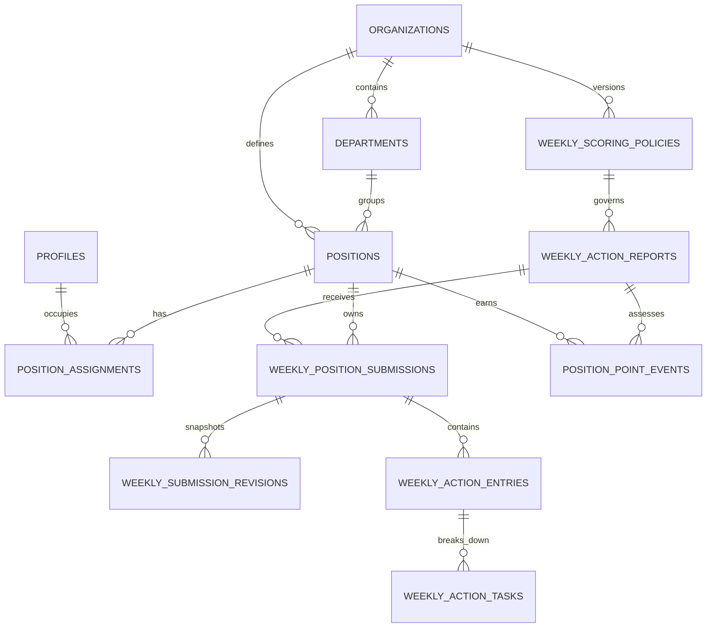

# MVP schema and component map

Updated September 16, 2026. This is the proposed implementation contract for the connected Compass MVP. Component names describe the target architecture, not completed React integrations. The SQL proposal is under `supabase/drafts` pending the database validation gates.

## Planning and accountability chain



The scorecards report enterprise outcomes. Department workplans translate those outcomes into annual tactics. Project plans organize delivery. Weekly accountability records the specific result a position will move that week. Weekly task completion is supporting evidence; it does not directly manufacture a scorecard KPI value.

## Accountable identity and weekly records



- `profiles` represents authenticated people.
- `positions` represents durable organizational accountability and is the identity shown in the product.
- `position_assignments` links an occupant to a position through Admin-managed assignments without effective dates. Separate user role assignments and per-user capabilities control application access. Staff changes do not move or erase the position's history. See [confirmed access and launch contract](access-and-launch-contract.md); the draft SQL has not yet been reconciled to this contract.
- `weekly_action_reports` defines one organization cycle and stores server-derived opening, deadline, and grace timestamps.
- `weekly_position_submissions` contains one position’s current weekly decision.
- `weekly_submission_revisions` preserves every finalized snapshot.
- `position_point_events` contains one scoring outcome per position and weekly report. Before-deadline revisions may update that outcome; it is not yet an immutable event ledger.

## Weekly scoring contract

All boundaries use the organization’s IANA timezone. HDC defaults to `America/New_York`, and PostgreSQL resolves daylight saving time.

| Outcome | Boundary | Points |
| --- | --- | ---: |
| On-time enterprise priority | First valid submission at or before Friday 5:00 p.m. | +5 |
| On-time opt-out | Explicit opt-out at or before Friday 5:00 p.m. | 0 |
| Grace-window submission | After Friday 5:00 p.m. through Monday 9:00 a.m. | -3 |
| Missed submission | No valid submission when Monday 9:00 a.m. passes | -10 |

The cycle opens Monday at 12:00 a.m. An on-time enterprise submission requires at least one linked enterprise priority. An opt-out cannot contain an enterprise priority, though department work may remain in the draft.

One `(weekly report, position)` ledger key makes assessment idempotent. Repeated submission and concurrent retries cannot create additional rewards or deductions. Before Friday 5:00 p.m., changing between a real priority and opt-out updates the same on-time event to `+5` or `0`; the edit itself has no score. After the deadline, revision history remains available while the established timing event stays unchanged.

Points begin at 100 and carry forward. `position_annual_point_activity` groups yearly activity without resetting the lifetime balance. Milestone badges, leaderboards, and other rewards are deferred.

## Planning data model

| Surface | Existing records to reuse | Required additions |
| --- | --- | --- |
| 2030 Plan | `strategic_plans`, `strategic_pillars`, `metrics`, `metric_values` | Explicit metric-to-pillar links, targets by period, polarity/aggregation metadata |
| Annual Scorecard | `metrics`, `metric_values`, `reporting_periods`, enterprise `priorities` | Ten `scorecard_domains`, domain/metric ordering, metric targets and observations, initiative registry flag |
| Department Workplans | `workplans`, `key_objectives`, `objective_kpis` | Position ownership, approval revisions, milestone dates and strategy links |
| Project Plans | Do not overload enterprise `initiatives` | `projects`, `project_objective_links`, `project_milestones`, `project_deliverables`, position assignments |
| Weekly Accountability | Existing weekly report/entry/task tables | Position submissions, immutable revisions, project link, desired result, support needed, server scoring ledger |

The next planning migration should create project-plan records and scorecard-domain links before weekly entries receive a `project_id`. This avoids reusing one identifier for both an enterprise initiative and a delivery project.

## Front-end feature boundaries

```text
src/features/
├── scorecards/
│   ├── components/
│   ├── hooks/
│   └── routes/
├── workplans/
├── projects/
├── weekly-accountability/
├── leadership-rollup/
└── shared-planning/
```

Create these modules as accepted proof-of-concept surfaces move into React. The static `public/scorecard-demo/` remains the visual reference during the move; it is not a second production application.

| Route / surface | Production components | Data boundary | First acceptance check |
| --- | --- | --- | --- |
| `/scorecards/2030` | `StrategicScorecard`, `PillarCard`, `PillarSignals`, `MetricRow`, `MetricDrawer` | `useStrategicScorecard(periodId)` | Five pillar signals reconcile with their metric rows |
| `/scorecards/annual` | `AnnualScorecard`, `DomainCard`, `DomainSignals`, `InitiativeStatusList`, `MetricDrawer` | `useAnnualScorecard(periodId)` | Ten domain signals and initiative count reconcile with drill-through lists |
| `/workplans` | `WorkplanList`, `WorkplanEditor`, `ObjectiveEditor`, `KpiEditor`, `ApprovalPanel` | `useWorkplans(periodId, departmentId)` | Approved objective traces to pillar, enterprise priority, and accountable position |
| `/projects` | `ProjectList`, `ProjectEditor`, `MilestoneEditor`, `DeliverableEditor`, `ProjectTeam` | `useProjects(periodId, departmentId)` | More than one project can support an objective; milestones persist |
| `/weekly` | `WeeklyWorkspace`, `CapacityChoice`, `PriorityEditor`, `ActionItemEditor`, `SubmissionBar` | `useWeeklySubmission(reportId, positionId)` and `finalize_weekly_submission` RPC | Draft, real priority, and opt-out survive refresh; score event occurs once |
| `/weekly/team` | `WeeklyRollup`, `PositionSubmissionRow`, `SubmissionDrawer` | `useWeeklyRollup(reportId)` | Submitted, opted out, late, missed, and draft states are distinct |
| `/accountability` | `PositionPointSummary`, `AnnualPointActivity`, `SubmissionHistory` | point-balance and annual-activity views | Opening 100, yearly change, and lifetime balance reconcile with ledger |

## Shared components

- `PlanningShell`, `PlanningNav`, `ReportingPeriodSelect`, and `PositionContext` establish the selected period and accountable position.
- `StatusSignal`, `StatusBadge`, `MetricProgress`, and `DetailDrawer` provide the scorecard visual language.
- `Field`, `FormSection`, `SaveStatus`, `EmptyState`, and `ErrorState` keep forms readable and accessible.
- Color is always paired with text. Server errors, deadline state, and unsaved changes are announced to assistive technology.

## Connected build order

1. Inventory the hosted schema, reconcile branch migration history, and pass local authorization and scoring tests before promoting the draft SQL and applying it to the development Supabase project.
2. Seed positions and effective assignments, then prove one authenticated position can save and finalize a weekly submission.
3. Port the weekly workspace into `src/features/weekly-accountability` and replace local storage with scoped queries and the finalize RPC.
4. Build the team rollup from submitted records and immutable revisions.
5. Add project-plan and scorecard-domain migrations, then connect workplans, projects, and both scorecards.
6. Add the Monday 9:00 a.m. scheduled assessment only after authenticated submission and retry tests pass.
